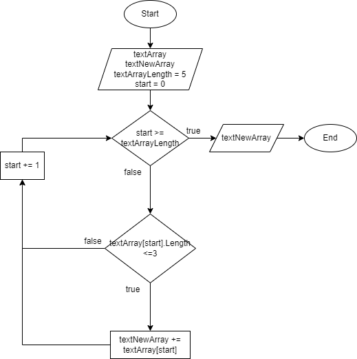

# Принцип работы программы
## Блок-схема алгоритма

## Описание
Алгоритм работает следующим образом: пользователь вводит строки в textArray (в блок-схеме до 5 строк), имеющие различное количество символов. Далее программа проходит по каждой строке массива, выискивая строку с длиной не больше 3. Если такие находятся, то данные строки записывает в новый массив. В конце программа выводит пользователю массив с такими строками.